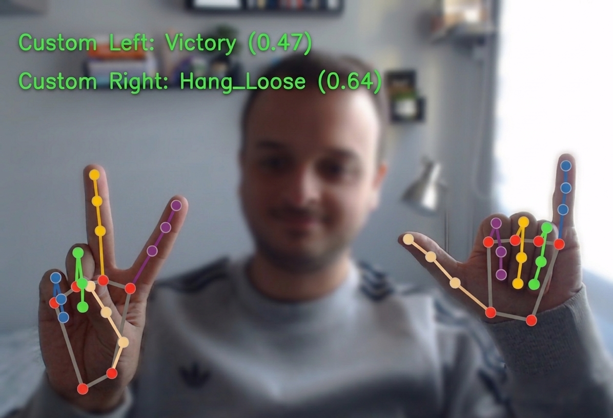

# Computer Vision for Gesture Recognition

This portfolio project presents a gesture recognition prototype that combines MediaPipe hand tracking with a custom machine learning classifier. The focus is on building a working proof-of-concept that shows how off-the-shelf vision tools and custom gesture models can be joined into a real application flow.

## Summary

- [Motivation](#motivation)
  - [EN-🇺🇸](#EN-🇺🇸)
  - [PT-🇧🇷](#PT-🇧🇷)
- [What this project demonstrates](#what-this-project-demonstrates)
- [Demo](#demo)
- [Project structure](#project-structure)
- [Setup](#setup)
  - [Requirements](#requirements)
  - [Install dependencies](#install-dependencies)
  - [Download the MediaPipe model](#download-the-mediapipe-model)
- [Usage](#usage)
  - [Collect gesture data](#collect-gesture-data)
  - [Train the gesture model](#train-the-gesture-model)
  - [Run real-time gesture recognition](#run-real-time-gesture-recognition)
- [Notes](#notes)
- [Recommended workflow](#recommended-workflow)

## Motivation

### EN-🇺🇸

This project was created to demonstrate how off-the-shelf computer vision tools can be combined into a practical solution for business needs, without depending on expensive commercial models. The idea was to show a more accessible development path where ready-made vision models are used as functional components inside a custom application.

I also built this project out of curiosity about visual computing and gesture-driven interaction. It is a portfolio example of how to bridge the gap between prototype vision models and a solution-ready architecture.

While the code shows a full gesture recognition workflow, it is not yet a complete production application. The current implementation proves the concept and can be adapted into larger applications in the future.

*Simple, but without AI*

### PT-🇧🇷

- O projeto foi desenvolvido para mostrar como usar modelos prontos de visão computacional em uma solução prática, reduzindo dependência de componentes caros.
- Ele demonstra a captura de dados de gesto, o treinamento de um classificador personalizado e o reconhecimento em tempo real com webcam.
- O foco principal é o protótipo e o fluxo de trabalho integrado, não a entrega de um sistema de produção completo.
- A parte de treinamento já conta com busca de hiperparâmetros, mas ainda pode ser expandida com mais engenharia de features, validação e otimização para implantação.

Este projeto é um exemplo de como uma aplicação de visão computacional pode ser construída de forma acessível e funcional, servindo tanto para portfólio quanto para explorar soluções de gesture recognition em projetos reais.

*Simples, mas sem IA*

## What this project demonstrates

- Real-time hand landmark detection using MediaPipe.
- Custom gesture data collection from a webcam.
- Training a classifier with labeled hand landmark features.
- Live gesture prediction with on-screen feedback.
- A practical way to combine off-the-shelf vision tools and custom machine learning.

## Demo

Below is an example image of the gesture recognition process. Add your own screenshot here to show the live prediction interface and how gestures are recognized.



## Project structure

- `collect_landmark_data.py` - Capture hand landmark data from a webcam and save it to a CSV dataset.
- `train_model.py` - Train a custom gesture recognition model from CSV landmark data.
- `gesture_recognition.py` - Run real-time gesture prediction using MediaPipe hand landmarks and the trained classifier.
- `data/gestures/hand_landmarks_data.csv` - Example or generated gesture dataset.
- `models/gesture_recognizer.task` - MediaPipe gesture recognition model asset.
- `models/custom_gesture_model.joblib` - Trained custom gesture classifier.
- `models/label_encoder.joblib` - Label encoder for gesture class names.

## Setup

### Requirements

- Python 3.12 or newer
- OpenCV
- MediaPipe
- NumPy
- pandas
- scikit-learn
- joblib
- requests
- torch
- torchvision
- matplotlib
- ipykernel

### Install dependencies

This project uses `uv` to manage Python packages and the virtual environment.

```bash
uv init .
uv venv
uv sync
```

If you need to add a new library later, use `uv add <package-name>`.

Then activate the environment:

```bash
.venv\Scripts\activate
```

If you prefer not to use `uv`, install dependencies manually with `pip`.

### Download the MediaPipe model

The `gesture_recognition.py` script can download the MediaPipe model automatically if it is not already present in `models/gesture_recognizer.task`.

For `collect_landmark_data.py`, make sure the file exists before running.

## Usage

### Collect gesture data

Use this script to capture hand landmarks and label them for training. The output is appended to `data/gestures/hand_landmarks_data.csv` by default.

```bash
python collect_landmark_data.py --label <gesture_name> --output data/gestures/hand_landmarks_data.csv
```

Controls while collecting:

- `s` - Save a single frame of landmarks
- `r` - Start/stop continuous recording
- `q` - Quit

Example:

```bash
python collect_landmark_data.py --label thumbs_up
```

### Train the gesture model

After collecting enough labeled landmark samples, train the custom classifier:

```bash
python train_model.py
```

This script reads `data/gestures/hand_landmarks_data.csv`, performs hyperparameter search for a `RandomForestClassifier`, and saves:

- `models/custom_gesture_model.joblib`
- `models/label_encoder.joblib`
- `models/custom_gesture_model_best_params.txt`

The training code is included to support the gesture recognition workflow, but model training is not the main focus of this portfolio project. There is still room to improve the training pipeline with additional feature engineering, model selection, and deployment-ready optimization.

### Run real-time gesture recognition

Start the live demo using your webcam:

```bash
python gesture_recognition.py
```

This script will:

- load the MediaPipe gesture model asset
- load the custom classifier and label encoder
- read webcam frames
- detect hand landmarks
- predict the gesture label
- display the result on screen

Press `q` to close the window.

## Notes

- If you want to keep models and data out of Git, add `models/*.joblib`, `models/*.task`, and `data/MNIST/raw/` to `.gitignore`.
- The custom model uses hand landmarks and handedness to classify gestures.
- Add more labeled gestures and examples to improve accuracy.

## Recommended workflow

1. Activate your virtual environment.
2. Collect data for each gesture label.
3. Train the model with `python train_model.py`.
4. Run the live recognition demo with `python gesture_recognition.py`.
